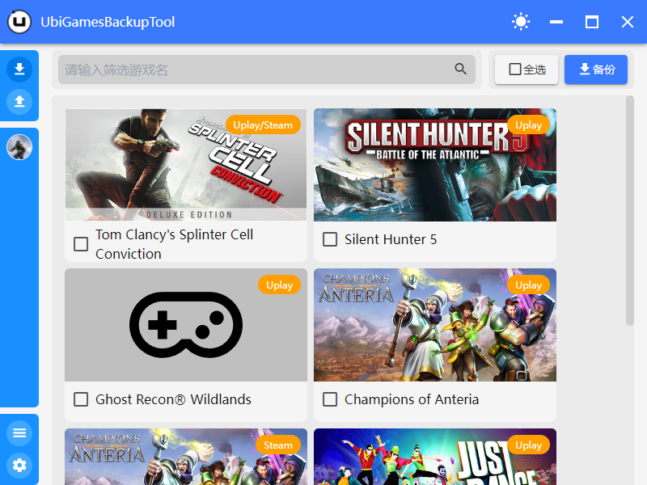

<h1 align="center" style="text-align:center;">

<br />
UbiGamesBackupTool
</h1>
<p align="center">
	<strong>育碧游戏存档备份工具</strong>
</p>

<p align="center">
    <a target="_blank" href="https://github.com/semantic-release/semantic-release">
        
    </a>
    <a target="_blank" href="https://github.com/lzjyzq2/UbiGamesBackupTool/releases">
        
    </a>
    <a target="_blank" href="#">
        
    </a>
    <a target="_blank" href="https://github.com/lzjyzq2/UbiGamesBackupTool/blob/dev/LICENSE">
        
    </a>
    <a target="_blank" href="https://jq.qq.com/?_wv=1027&k=6vthnRcm">
        
    </a>
</p>


## 📷 截图


## ✨ 适用群体
- 需要备份不支持 Uplay 云存档的单机游戏的玩家（如：《刺客信条：黑旗》《细胞分裂：黑名单》等）
- 无法正常通过 Uplay 云存档备份存档的玩家

## 🛒 现有特性
- 自动探测存档路径
- 支持检测多个 Uplay 用户
- 还原存档
- 开机自动启动
- 实时备份游戏（暂时仅支持部分游戏）
- “搜索”功能

## 🚀 开发
### 📦 增加支持备份的游戏

支持备份的游戏列表清单存放于[`src\assets\games.json`](src\assets\games.json)中，以《刺客信条：起源》为例其格式内容及意义如下：

```json
[
    ...
    {
        "id": 3539,                                     // 游戏ID，对于游戏存档文件夹名称，必填
        "name": "Assassin's Creed Origins",             // 游戏名称，必填
        "img": "173bca0f8923c59a731b6f43a9810970.png",  // 对应Uplay缓存中游戏图片，未使用
        "platform": "Uplay",                            // 该游戏对应游戏平台，应为Uplay、Steam、Uplay/Steam三者其一，此项非固定值
        "title": "Assassin's Creed Origins",            // 应为游戏窗体标题值，原用于支持实时备份
        "appname": "ACOrigins.exe",                     // 应为游戏进程可执行文件名称，现用于支持实时备份
        "picture": "Assassin's Creed® Origins.jpg",     // 展示的游戏对应图片，存放于public\image\games\下，必填
        "process": null                                 // 无效字段
    },
    // 添加游戏配置在此处
]
```

当你想要让一个游戏支持备份时，在[`src\assets\games.json`](src\assets\games.json)数组尾部增加对于配置，即可支持该游戏备份与还原。

### 🕑 增加支持实时备份的游戏

如果该游戏配置已存在于[`src\assets\games.json`](src\assets\games.json)中，但不支持实时备份，可将已确认的`游戏进程可执行文件名称`填写到对应配置的`appname`上，若该游戏配置不存在，则添加上改配置的同时，配置其`appname`。

## 🛠 提交代码
本项目使用`husky`和`commitlint`在提交时进行commits格式检查，你可以使用`git cz`交互式命令来创建一个规范的提交信息。

## 🔍 反馈问题 & 联系方式
- QQ群：177565385 （[点此加群](http://qm.qq.com/cgi-bin/qm/qr?k=4i2b084zpghCqs_QDJPPbldona9HMgtT&group_code=177565385)）
- 使用本项目的 [Issues 页面](https://github.com/JueLuo99/UbiGamesBackupToolX/issues)